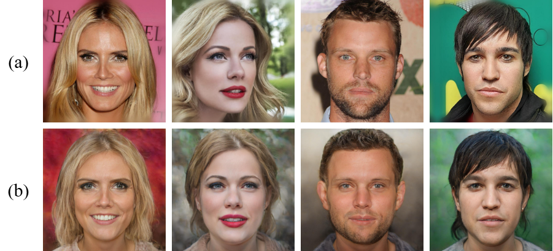
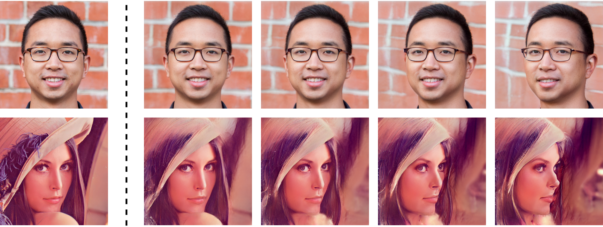
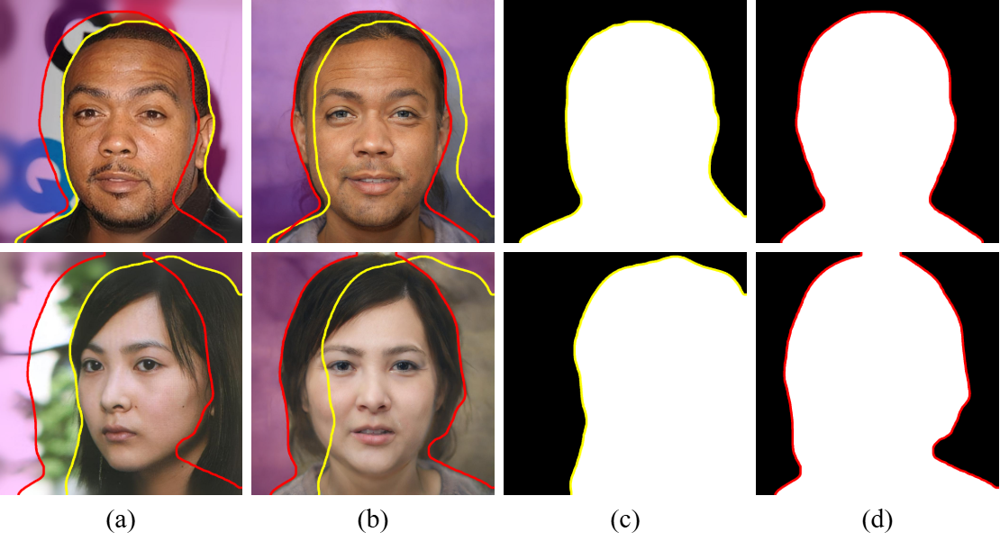
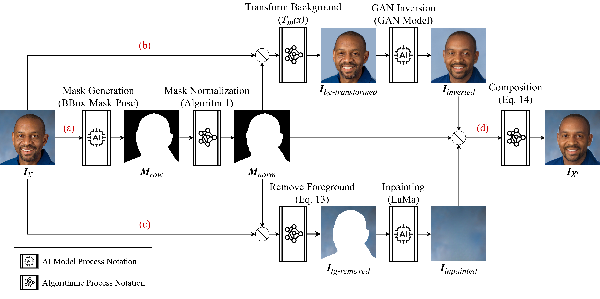

# QBDG: Quantifying Background Distortion in GAN Inversion

This repository consolidates the codebases and downstream experiment apps used
for QBDG: measuring and visualizing background distortion introduced by GAN
inversion and face frontalization pipelines.

This repository is organized around runnable apps rather than a single
monolithic script. Imported research code stays under `subprojects/`, while
QBDG-specific orchestration lives under `apps/`.

## Repository Layout

```text
qbdg/
  apps/             # Downstream QBDG apps and runnable scripts.
  images/           # Paper/reference figures used by the README and report.
  setup/            # Conda environment files and model download scripts.
  subprojects/      # Imported codebases used by the apps.
```

## Figures

### pSp Background Distortion Examples



### PTI Background Distortion Examples



### pSp Background IoU Measurement



### Image Composition Framework



## Subprojects

- `subprojects/BBoxMaskPose`: source project used for foreground/person mask
  creation and the original background color transformation logic.
- `subprojects/pixel2style2pixel`: pSp codebase used for FFHQ face
  frontalization.

## Environment Setup

Run commands from the `qbdg/` repository root.

### BBoxMaskPose

Create or update the BBoxMaskPose environment:

```bash
conda env create -f setup/BBoxMaskPose/environment.yml
conda activate bbox_mask_pose
```

If the environment already exists, activate it directly:

```bash
conda activate bbox_mask_pose
```

### pixel2style2pixel

The pSp app expects a conda environment named `pixel2style2pixel` by default.

To recreate it from the exported environment file:

```bash
conda env create -f setup/pixel2style2pixel/environment.yml
conda activate pixel2style2pixel
```

If you already have the environment:

```bash
conda activate pixel2style2pixel
```

### Shared Utility Environments

Some lightweight image-processing apps need a Python environment with common
image-processing dependencies such as OpenCV, Pillow, NumPy, and scikit-image:

- `apps/mask_normalization`
- `apps/background_transformation`
- `apps/psp_iou`

The run scripts default to the conda environment name `seamless_clone`.
Override that default when needed:

```bash
MASK_NORMALIZER_CONDA_ENV=<env_name> bash apps/mask_normalization/run.sh
BACKGROUND_TRANSFORM_CONDA_ENV=<env_name> bash apps/background_transformation/run.sh
PSP_IOU_CONDA_ENV=<env_name> bash apps/psp_iou/run.sh
```

You can also bypass the environment-name lookup by passing an explicit Python
executable:

```bash
MASK_NORMALIZER_PYTHON=/path/to/python bash apps/mask_normalization/run.sh
BACKGROUND_TRANSFORM_PYTHON=/path/to/python bash apps/background_transformation/run.sh
PSP_IOU_PYTHON=/path/to/python bash apps/psp_iou/run.sh
```

## Download Models

Use the root download script to prepare model weights/checkpoints:

```bash
bash setup/download_models.sh all
```

Download only BBoxMaskPose models:

```bash
bash setup/download_models.sh BBoxMaskPose
```

Download only pixel2style2pixel models:

```bash
bash setup/download_models.sh pixel2style2pixel
```

The downloader prepares:

- BBoxMaskPose SAM checkpoints under `subprojects/BBoxMaskPose/models/SAM/`.
- pSp FFHQ frontalization checkpoint under
  `subprojects/pixel2style2pixel/pretrained_models/`.
- dlib 68-point landmark predictor under
  `subprojects/pixel2style2pixel/pretrained_models/`.

## Apps

### 1. Mask Normalization

Creates raw BBoxMaskPose masks and normalizes them into binary person masks.

```bash
bash apps/mask_normalization/run.sh
```

Defaults:

- Inputs: `apps/mask_normalization/inputs/`
- Raw masks: `apps/mask_normalization/outputs/raw_masks/`
- Normalized masks: `apps/mask_normalization/outputs/normalized_masks/`

Optional explicit paths:

```bash
bash apps/mask_normalization/run.sh <input_dir> <raw_mask_dir> <normalized_mask_dir>
```

### 2. Background Transformation

Applies controlled background transformations using an image and its
corresponding normalized mask. This app uses its own transformation code so it
does not require switching the BBoxMaskPose branch used by mask normalization.

```bash
bash apps/background_transformation/run.sh
```

Defaults:

- Inputs: `apps/background_transformation/inputs/`
- Masks: `apps/background_transformation/inputs/`
- Outputs: `apps/background_transformation/outputs/`

Default transformation modes:

```text
dark white mean median mode random gray blur
```

Override modes:

```bash
BG_TRANSFORM_MODES="white blur gray" bash apps/background_transformation/run.sh
```

### 3. pSp Frontalization

Runs pSp FFHQ frontalization on input images.

```bash
bash apps/psp_frontalization/run.sh
```

Defaults:

- Inputs: `apps/psp_frontalization/inputs/`
- Outputs: `apps/psp_frontalization/outputs/`
- Checkpoint:
  `subprojects/pixel2style2pixel/pretrained_models/psp_ffhq_frontalization.pt`
- Conda environment: `pixel2style2pixel`

Output folders:

- `inference_results/`: frontalized images.
- `inference_coupled/`: input/output side-by-side images.
- `stats.txt`: runtime summary.

Optional overrides:

```bash
PSP_BATCH_SIZE=1 PSP_NUM_WORKERS=0 bash apps/psp_frontalization/run.sh <input_dir> <output_dir>
```

### 4. pSp Background IoU

Measures background-mask overlap between a ground-truth image and a pSp
frontalization result.

Mask convention:

- White: foreground/person.
- Black: background.

The reported IoU is therefore the IoU of the black/background region.

```bash
bash apps/psp_iou/run.sh
```

Default inputs:

```text
apps/psp_iou/inputs/gt.jpg
apps/psp_iou/inputs/gt_mask.png
apps/psp_iou/inputs/psp_front.jpg
apps/psp_iou/inputs/psp_front_mask.jpg
```

Outputs:

- `metrics.csv`
- `00_summary_2x2_background_iou.png`
- per-image border and overlay visualizations

## Notes

- `apps/*/outputs/` are generated artifacts.
- Large image/model artifacts are intentionally kept out of git.
